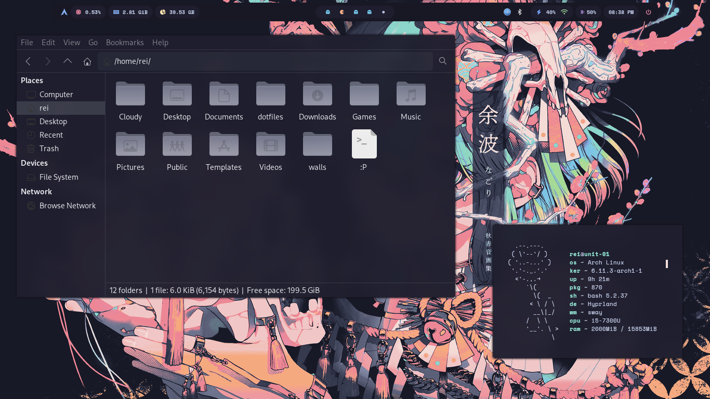

<h1 align="center">
	hyprland dotfiles
</h1>


<br>
<div align="center">
<p>
<a href="https://github.com/NotMugil/dotfiles/stargazers"><a>
<a href="https://github.com/NotMugil/dotfiles/issues"></a>
<a href="https://github.com/NotMugil/dotfiles/"></a>
<a href="https://github.com/NotMugil/dotfiles/commits/main/"></a>
<a href="https://github.com/NotMugil/dotfiles?tab=GPL-3.0-1-ov-file"></a>
</p>
</div>


> [!CAUTION]
> This repository's **main** branch is experimental and will have frequent commits that may introduce breaking changes.
>
> If you prefer a stable version, please check out the **stable** branch.


<details open>
<summary>
	
#### more previews
</summary>

|  **Lockscreen**                                          |
| -------------------------------------------------------- |
|               |

<table>
  <tr>
    <td></td>
    <td></td>
    <td></td>
  </tr>
</table>

| **Neofetch & Thunar**                                    |
| -------------------------------------------------------- |
|               |

<table>
  <tr>
    <td></td>
    <td></td>
    <td></td>
  </tr>
</table>

| **Wlogout logout menu**   			           |
| -------------------------------------------------------- |
|               |

<table>
  <tr>
    <td></td>
    <td></td>
    <td></td>
  </tr>
</table>

| **Rofi Application Launcher**                            |
| -------------------------------------------------------- |
|              |

<table>
  <tr>
    <td></td>
    <td></td>
    <td></td>
  </tr>
</table>


| **Wallpaper Selector**                                   |
| -------------------------------------------------------- |
|               |

<table>
  <tr>
    <td></td>
    <td></td>
    <td></td>
  </tr>
</table>


| **Notification Center (SwayNC)**                         |
| -------------------------------------------------------- |
|               |

</details>

#### Installation
##### Arch Linux
I have a really messy installation script made for my own use. I wouldn’t recommend others use this script. 

**Recommended Approach:** Please manually install the configurations and dependencies.

> [!Important]
> Install it only if you have a basic understanding of what you are doing. Don't blame me if things go wrong!


To install using the script, execute the following commands:
```shell
curl -O install.sh https://raw.githubusercontent.com/NotMugil/dotfiles/main/install.sh
chmod +x install.sh
./install.sh
```

#### Manual Installation
##### Arch Linux
You may want to set up an AUR helper. Check the instructions provided [here](https://github.com/Jguer/yay?tab=readme-ov-file#installation) to install yay.
- Install the packages mentioned in the [wiki](https://github.com/NotMugil/dotfiles/wiki/Packages)
- or you can check the packages list in the installation script.
  
After Installing the packages, make sure to backup your previous configs if needed.  

1. Clone the repository into your local system.
  
```bash
git clone --depth=1 https://github.com/NotMugil/dotfiles.git && cd dotfiles
```

2. Copy the configs to their respective directories. 

```bash
cp -r dots/.config/* ~/.config/
cp -r dots/.icons ~/
cp -r dots/.themes ~/
cp -r dots/.zshenv ~/
```

3. To install sddm theme, copy the files into thier respective dir.

```bash
cp -r prefs/sddm.conf /etc/sddm.conf
cp -r misc/sddm /usr/share/sddm/themes/
```

<details open>
<summary>
	
#### Shortcuts

</summary>


| Keys           		              	| Functionality                                                                   |
|-----------------------------------------------|---------------------------------------------------------------------------------|
| <kbd>SUPER</kbd> + <kbd>RETURN</kbd>          | Launch Kitty				                                          |
| <kbd>SUPER</kbd> + <kbd>D</kbd>		| Launch Rofi 				    	                                  |
| <kbd>SUPER</kbd> + <kbd>E</kbd>      		| Launch Thunar File Manager	 	                                          |
| <kbd>SUPER</kbd> + <kbd>Q</kbd>         	| Kill active window                                                              |
| <kbd>SUPER</kbd> + <kbd>W</kbd>          	| Opens wallpaper selector                                                        |
| <kbd>SUPER</kbd> + <kbd>U</kbd>          	| Opens waybar selector                                                           |
| <kbd>SUPER</kbd> + <kbd>V</kbd>          	| Toggle floating window  	                                                  |
| <kbd>SUPER</kbd> + <kbd>L</kbd>          	| Lockscreen                                            	         	  |
| <kbd>SUPER</kbd> + <kbd>M</kbd>          	| Launch wlogout                                        		          |
| <kbd>SUPER</kbd> + <kbd>Shift</kbd> + <kbd>R</kbd>| Opens sway notification center 	                                          |
| <kbd>SUPER</kbd> + <kbd>Alt</kbd> + <kbd>T</kbd>| Launch theme selector	 	                                          |


</details>

#### Inspiration
some of the cool people i took inspiration from for making my dotfiles. without them, this repo wouldn't exist.
- [matt-ftw/dotfiles](https://github.com/Matt-ftw/dotfiles) 
- [gh0stzk/dotfiles](https://github.com/gh0stzk/dotfiles)
- [zakar98k/hyprland-catppuccin-dotz](https://github.com/Zakar98k/hyprland-catppuccin-dotz)
- [deathemonic/cat-dots](https://github.com/Deathemonic/Cat-Dots)
- [zdyantb/hyprnova](https://github.com/zDyanTB/HyprNova)

#### Resources
dropping some informative stuff and resources that helped me here.
- [catppuccin](https://github.com/catppuccin)
- [r/unixporn](https://www.reddit.com/r/unixporn/)
- [nam's ricing guide](https://namishh.me/blog/ricing)
- [hyprland wiki](https://wiki.hyprland.org)

