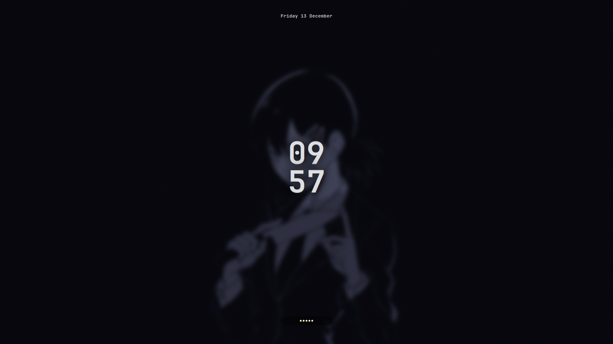
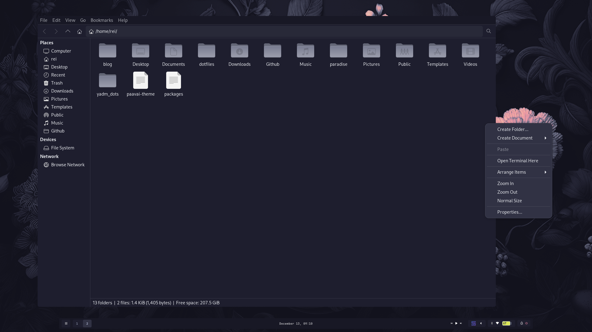
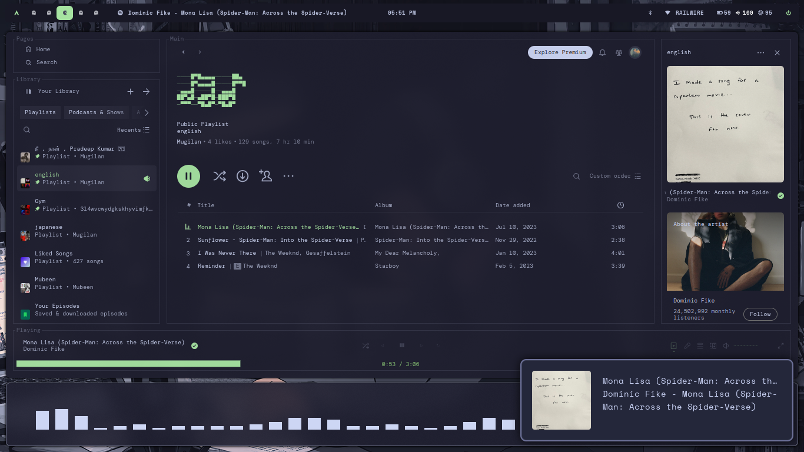
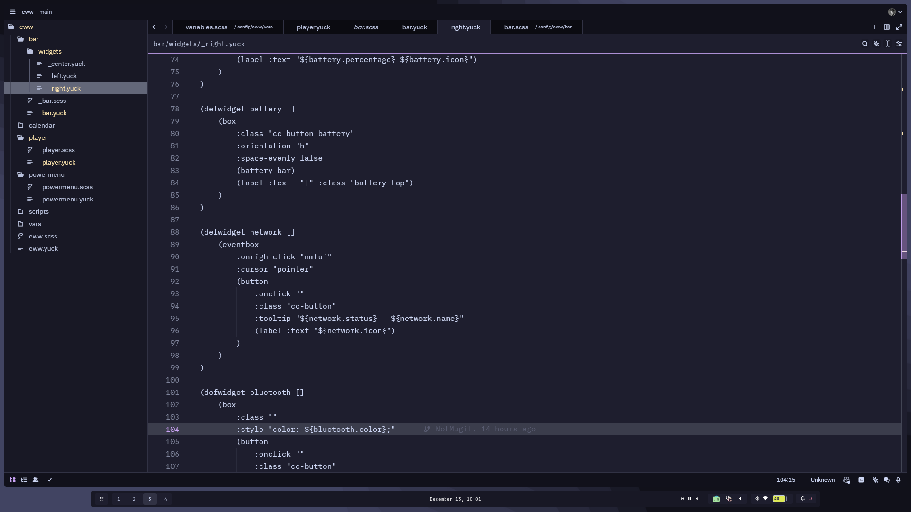
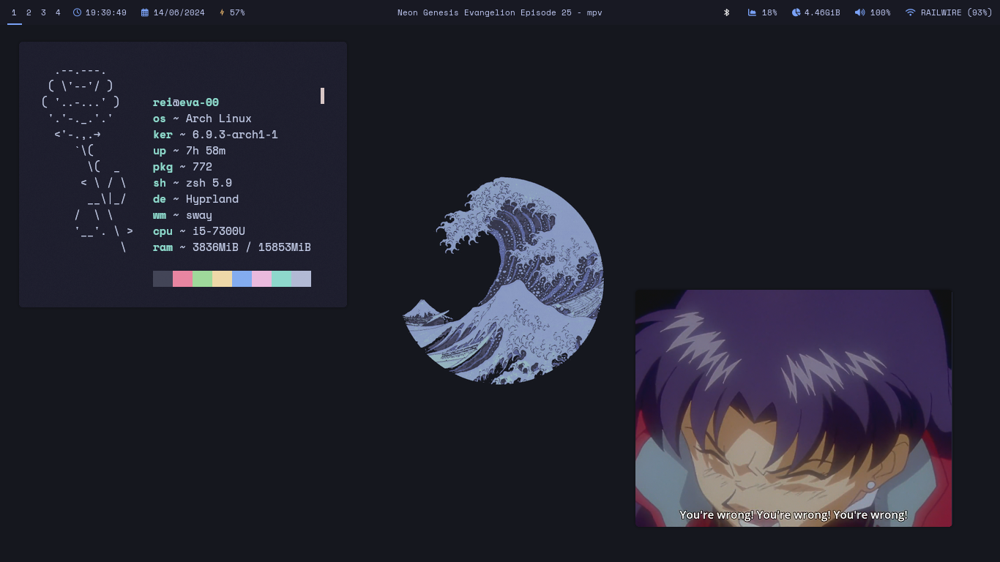
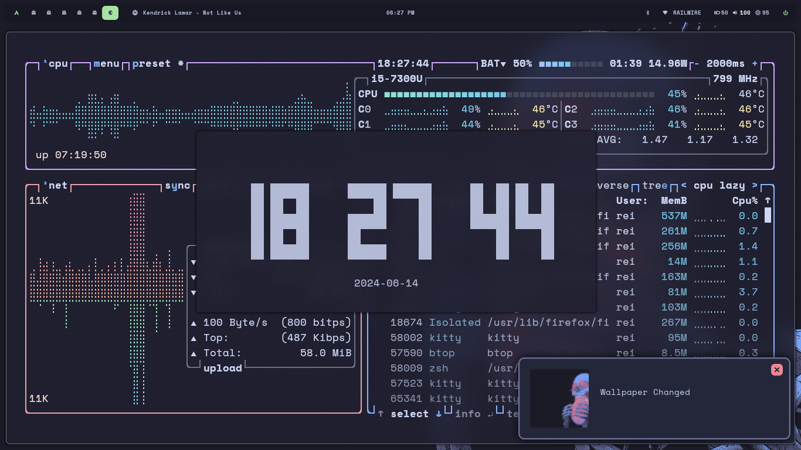

<h3 align="center">
  
  
  
  <p align="center"></p>
</h3>

<div align="center">
<p>
<a href="https://github.com/NotMugil/dotfiles/stargazers"><a>
<a href="https://github.com/NotMugil/dotfiles/issues"></a>
<a href="https://github.com/NotMugil/dotfiles?tab=GPL-3.0-1-ov-file"></a>
</p>
</div>


## Information
- Operating System • [Arch Linux](https://archlinux.org)
- Window Manager/DE • [Hyprland](https://hyprland.org/)
- Terminal • [kitty](https://github.com/kovidgoyal/kitty)
- Shell • zsh
- Aur Helper • [yay](https://github.com/Jguer/yay)
- Panel • [waybar](https://github.com/Alexays/Waybar)
- Launcher • [rofi](https://github.com/davatorium/rofi)
- File Manager • [thunar](https://wiki.archlinux.org/title/thunar)/[yazi](https://github.com/sxyazi/yazi)
- Notification Daemon • [swaync](https://github.com/ErikReider/SwayNotificationCenter)
- Wallpaper Daemon • [swww](https://github.com/LGFae/swww)
- Text Editor • [neovim](https://neovim.io/)
- Colorscheme • [catppuccin mocha](https://github.com/catppuccin/catppuccin)

## ⚙️ Setup
  > [!WARNING]
  > This is a step by step guide for installing my dotfiles which is designed based on Arch Linux (and other Arch-based distributions). If you are running any other system, install the following packages with your respective OS's package manager.

### Manual Installation
  > [!NOTE]
  > Assuming that your AUR helper is [yay.](https://github.com/Jguer/yay)
  > To install yay on your arch based system, follow the instructions mentioned [here.](https://github.com/Jguer/yay?tab=readme-ov-file#installation) 
  1. Installing git version of Hyprland
     
   ```bash
   yay -Sy hyprland-git
   ```

  2. Installing required dependencies     
    
   ```bash
   yay -Sy kitty nano rofi-wayland swaync waybar playerctl mpv grim slurp jq bc pamixer pavucontrol \
 waybar-cava cava xdg-desktop-portal-hyprland wl-clipboard socat cliphist hyprpicker \
 nm-connection-editor dictd wl-clip-persist-git blueman bluez bluez-utils nwg-look \
 wlogout ttf-space-mono-nerd brightnessctl neovim thunar imv yazi \
 catppuccin-gtk-theme-mocha nm-connection-editor btop nvtop fastfetch neofetch 
   ```

  3. Finally, Installing the dotfiles
     
  > Cloning the repository into your local system.
  ```bash
    git clone https://github.com/NotMugil/dotfiles.git
    cd dotfiles
  ```

  > Copy the configs to their respective directories. Make sure to backup your previous configs if needed. 
  ```bash
    cp -r .config/* ~/.config/
    cp -r .scripts/* ~/
  ```

Congratulations, you are done installing the configurations! 🎉 


## 🖼️ Gallery
>[!NOTE] 
> Images included in the gallery may contain some softwares which may not be included in the packages list or the configurations.


|  **Lockscreen**                                          |
| -------------------------------------------------------- |
|               |

| **Wallpaper Selector**                                   |
| -------------------------------------------------------- |
|               |

| **Custom Startpage for firefox**                         |
| -------------------------------------------------------- |
|               |

| **Spotify (Spicetified) & Audio Visualizer**             |
| -------------------------------------------------------- |
|               |

| **Rofi Menu from adi1090x**                              |
| -------------------------------------------------------- |
|               |

| **Notification Center (SwayNC)**                         |
| -------------------------------------------------------- |
|               |

| **Neofetch**                                             |
| -------------------------------------------------------- |
|               |

| **Btop + tty-clock**                                     |
| -------------------------------------------------------- |
|               |


## 💻 Development
### Tasks
- [ ] Theme Switcher
- [ ] Add mpris to waybar
- [ ] More Hyprlock styles
- [x] More panel styles && panel selector

## Star History
[](https://star-history.com/#NotMugil/dotfiles&Date)

# Credits

- [Catppuccin](https://github.com/catppuccin/catppuccin) 
- [JaaKoolit's dotfiles](https://github.com/Jakoolit/hyprland-dots) 
- [Matt-ftw's dotfiles](https://github.com/Matt-ftw/dotfiles) 
- [gh0stzk's dotfiles](https://github.com/gh0stzk/dotfiles)
- [Hyprdots](https://github.com/prasanthrangan/hyprdots)
- [HyprNova](https://github.com/zDyanTB/HyprNova) 

_Thanks a lot for [r/unixporn](https://www.reddit.com/r/unixporn/) community for inspiring me to do this._

<div align="center">
  
</div>

<div align="right">
  <br>
  <a href="#top"><br><kbd> ^ </kbd><br></a>
</div>
