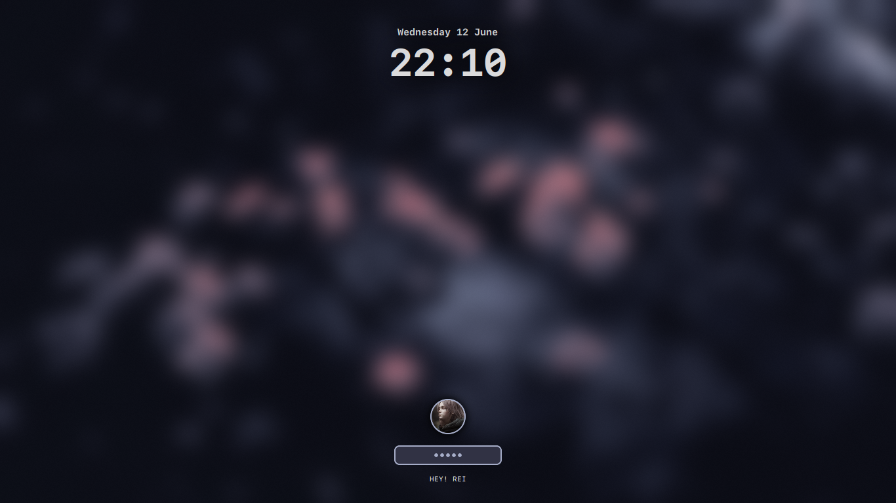

- Operating System • [Arch Linux](https://archlinux.org)
- Window Manager/DE • [Hyprland](https://hyprland.org/)
- Terminal • [Kitty](https://github.com/kovidgoyal/kitty)
- Shell • Bash
- Aur Helper • [Yay](https://github.com/Jguer/yay)
- Panel • [Waybar](https://github.com/Alexays/Waybar)
- Launcher • [Rofi](https://github.com/davatorium/rofi)
- File Manager • [Thunar]()/[Ranger]()
- Notification Daemon • [dunst](https://github.com/dunst-project/dunst)
- Wallpaper Daemon • [swww](https://github.com/LGFae/swww)
- Text Editor • [neovim](https://neovim.io/)
- Colorscheme • [Catppuccin Mocha](https://github.com/catppuccin/catppuccin)

## ⚙️ Setup
  > [!WARNING]
  > This is a step by step guide for installing my dotfiles which is designed based on Arch Linux (and other Arch-based distributions). If you are running any other system, install the following packages with your respective OS's package manager.

### Manual Installation
  > [!NOTE]
  > Assuming that your AUR helper is [yay.](https://github.com/Jguer/yay)
  > To install yay on your arch based system, follow the instructions mentioned [here.](https://github.com/Jguer/yay?tab=readme-ov-file#installation) 
  1. Installing git version of Hyprland
     
   ```bash
   yay -Sy hyprland-git
   ```

  2. Installing required dependencies     
    
   ```bash
   yay -Sy kitty nano rofi dunst waybar playerctl mpv grim slurp jq bc pamixer pavucontrol waybar-cava cava xdg-desktop-portal-hyprland wl-clipboard socat cliphist hyprpicker nm-connection-editor dictd wl-clip-persist-git blueberry bluez bluez-utils nwg-look wlogout ttf-space-mono-nerd brightnessctl neovim thunar ranger yazi catppuccin-gtk-theme-mocha nm-connection-editor btop nvtop fastfetch neofetch 
   ```

  3. Finally, Installing the dotfiles
     
  > Cloning the repository into your local system.
  ```bash
    cd && git clone https://github.com/NotMugil/dotfiles.git
    cd dotfiles
  ```

  > Copy the configs to their respective directories. Make sure to backup your previous configs if needed. 
  ```bash
    cp -r config/* ~/.config/
    cp -r .bashrc ~/
    mkdir ~/.wallpapers
    cp -r wallpapers/* ~/.wallpapers/
  ```

Congratulations, you are done installing the configurations! 🎉 


## 🖼️ Gallery
>[!NOTE] 
> Images included in the gallery may contain some softwares which may not be included in the packages list or the configurations.

| **File Manger TUI & Terminal Clock**                     |
| -------------------------------------------------------- |
|         |

| **Browser with Catppuccin theme**                        |
| -------------------------------------------------------- |
|                 |

| **Spotify-tui (Spicetified) & Audio Visualizer**         |
| -------------------------------------------------------- |
|           |

| **Wallpaper Selector**                                   |
| -------------------------------------------------------- |
|               |

|  **Lockscreen**                                          |
| -------------------------------------------------------- |
|                 |

## 💻 Development

### Known Issues
- [ ] Network management GUI
- [ ] Waybar bluetooth module not updating automatically
- [ ] rofi and wallpaper select only focuses after mouse movement

### Tasks
- [x] Wlogout configuration
- [x] More panel styles && panel selector
- [ ] Symlink management

# Credits
_Thanks a lot for [r/unixporn](https://www.reddit.com/r/unixporn/) community for inspiring me to do this._

<div align="center">
  
</div>
